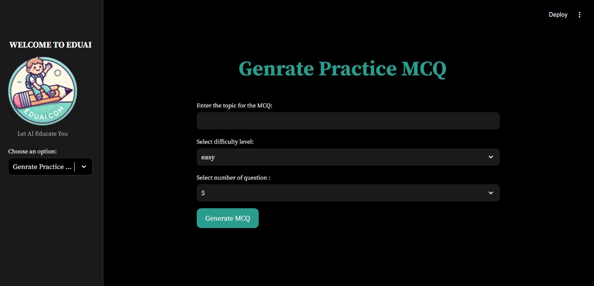

# EduAI
EduAI is an education-based AI system designed to enhance the learning experience for students in grades 9,10,11,12. The app includes features such as:

### 1. Chatting with textbooks for interactive learning


### 2. Getting solutions by uploading images

### 3. Generating practice MCQs

### 4. Transcribing YouTube videos for easy note-taking

### 5. Personalized self-assessment for individual progress tracking


These features help students engage with their study material in a dynamic and interactive way, fostering a deeper understanding of their subjects.
## steps to run the program 
### Clone the repository using 
```bash
git clone https://github.com/Vishal00812/AI-EDUCATION-SYSTEM.git
```
### Create a virtual enviroment
```bash
conda create -p venv python==3.10 -y
```
### Activate the Enviroment
```bash
conda activate venv
```
### Install the required libraries 
```bash
pip install -r requirements.txt
```
### Run the program
```bash
# Finally run the following command
streamlit run app.py
```